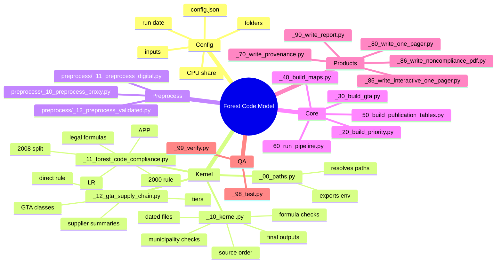

# Code Architecture

```mermaid
mindmap
  root((Forest Code Model))
    Config
      config.json
      folders
      inputs
      run date
      CPU share
    Kernel
      _00_paths.py
        resolves paths
        exports env
      _10_kernel.py
        source order
        dated files
        final outputs
        formula checks
        municipality checks
      _11_forest_code_compliance.py
        legal formulas
        LR
        APP
        2000 rule
        2008 split
      _12_gta_supply_chain.py
        GTA classes
        direct rule
        tiers
        supplier summaries
    Preprocess
      preprocess/_10_preprocess_proxy.py
      preprocess/_11_preprocess_digital.py
      preprocess/_12_preprocess_validated.py
    Core
      _20_build_priority.py
      _30_build_gta.py
      _40_build_maps.py
      _50_build_publication_tables.py
      _60_run_pipeline.py
    Products
      _70_write_provenance.py
      _80_write_one_pager.py
      _85_write_interactive_one_pager.py
      _86_write_noncompliance_pdf.py
      _90_write_report.py
    QA
      _98_test.py
      _99_verify.py
```

Rule: scripts orbit the kernel. Paths, dates, source order, expected products, and method checks stay centralized.
